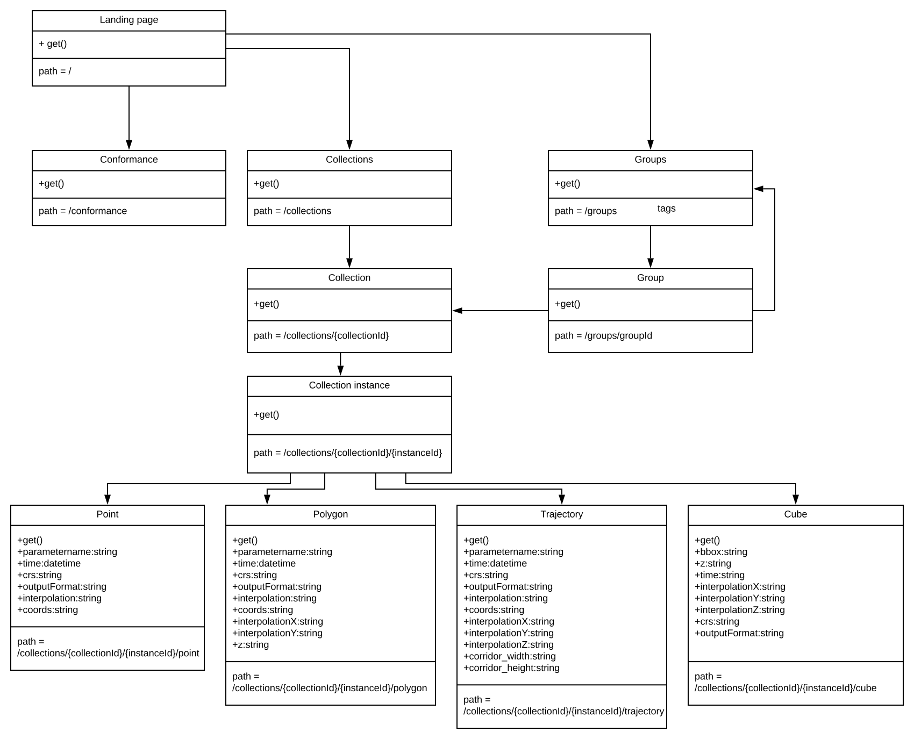

=== Weather on the Web Overview

This is a proposal for changing the approach to providing access to Meteorological data, it is a response to the rapidly growing data volumes and the changes in the IT landscape which has increased the number and type of user who are interested in access to the information.  

It is important to recognise that for the majority of users outside of the Meteorological community, weather (whilst important) is only one of the pieces of information that their decision making process is based on. The cost (in both time and effort) means that many organisations who could benefit from using the data don't because of the overhead in accessing it. Another consideration is that the users outside of the domain are generally not interested in the way the weather parameter values are generated, they want the best information required to make their decision in a timely manner.

Currently the solution to making data available generally falls into two camps: 

1) Build a system to provide access to a specific dataset:

    * **Pro**: Rich query functionality
    * **Con**: Query/API structure design tied to dataset

2) Platform is built which ingests the data and transforms the data from multiple sources into a canonical format.

    * **Pro**: Common access patterns for multiple data types
    * **Con**: Complex code base which gets increasingly difficult to change
 
For a large majority of interested users MetOcean data can be described as geo-temporal metadata, as it is information about the state of the ocean or atmosphere at a time and place which affects a business decision that they are making.  Therefore rather than thinking about the information from a data store point of view, API's can be based on geo-temporal query patterns; whilst this would limit the available functionality it would make it easier to provide standardised access to information without the need to build monolithic data platforms as the interface between the data producer has no MetOcean specific query options. 

The approach should also simplify the decommissioning process for future production systems, as it would remove the direct connection between the original Meteorological formats and the outputs consumed by customer facing product systems. It would also make it easier for products to access new data types since any new compliant system would have to support the query patterns and output formats. Testing would also be simplified by making comparisons between existing and replacement systems comparing the results based on the API query options and standardised output formats. 

This document describes a set of possible API definitions that cope with many of the existing use cases.

=== Approach
The core OGC web services are based around rich query capabilities against either Feature or Coverage stores. This can be an issue for MetOcean data where the storage mechanism for data is often driven by how its generated rather than by the type of information. Another downside is that it very difficult to optimise the OGC standards based query APIs due to the need to support a wide range of query patterns and their generic nature makes it more difficult to provide fine grained access to the information provided. The rich functionality of the standards also rely on the data consumer having a good understanding of the OGC standard as well as the data they are querying.

The Weather on the Web API concept is based around query type rather than the data structure, with an aim to make each query as simple as possible whilst being agnostic to whether the information is based on Coverage or Feature sources.  Rather than being based on the dataset, Weather on the Web defines data as collections. The core definition of a collection is that its members all share the same temporal and spatial dimensions and coordinate reference systems.  An artefact of the Weather on the Web approach is that the resource returned is generated by the parameters passed into the query and may not exist until the query is executed.

In order to make Weather on the Web easier to implement, it will be based on a 'family' of API's which follow a common pattern (based on the OGC core API guidelines and strongly influenced by WFS 3.0). The concept is that each API in the family should be based on a different query type, but follow common conventions for query parameter structures and output formats.

The API's discovery and query operations are implemented using the HTTP GET or POST methods. Discovery operations allow the server to be interrogated to determine what information is available, this includes the API definition of the server as well as metadata about the collections provided by the server.

Query operations allow values to be retrieved from the underlying data store based upon selection criteria, defined by the clients.

.Table
[cols="22%,42%,15%,26%"]
|===
| Resource              | Path                                                     |  HTTP   method | Document reference
| Landing page          | /                                 | GET            | <<_api_landing_page, API landing page>>
| Conformance classes   | /conformance                      | GET            |  <<_declaration_of_conformance_classes, Declaration of conformance classes>>
| Available groups      | /groups                      | GET            |  <<Groups metadata, list of groups of data>>
| Available child groups     | /groups/{groupId}                      | GET            |  <<Groups metadata, list of child groups/collections of data>>
| Available Collections | /collections                      | GET            |  <<Collections metadata, List of collections>> 
| Collection metadata   | /collections/{collectionId}       | GET            | <<Resource Collection metadata, List of collection instances metadata>>
| Available instances   | /collections/{collectionId}/{instanceId} | GET            | <<Resource Collection instance metadata, Collection instance metadata >>
| Query                 | /collections/{collectionId}/{instanceId}/{query type} | GET            | <<Bespoke Operations, Query pattern>>
|===

<<<

This document defines common Met Ocean query types:

* Get all data for a Point location
* Get all data for a list of Point locations
* Get all data with a Polygon
* Get all data within a Cube  
* Get all data along a defined Trajectory

The API's are determined by the structure of the spatial query coordinates and the returned information will be based on the information in the collection that intersects the requested location.

=== Weather on the Web API core

The Weather on the Web API core which must be implemented by all Weather on the Web API's is an implementation of the OGC Open API common specification core without the final feature interface, this is replaced with a path parameter which identifies the type of API. 

* the APIDefinition (path /API),

* the Conformance statements (path /conformance),

* the DatasetGrouping metadata (path /groups).

* the DatasetDistribution metadata (path /collections).

The APIDefinition endpoint describes the capabilities of the API. Clients use that information to connect to the API. Development tools can use this information to support the implementation of the API by servers and clients. Accessing the APIDefinition using HTTP GET returns a description of the API.

Accessing the Conformance statements using HTTP GET returns a list of URIs for the requirements classes implemented by the API.

The DatasetGrouping consists of a set of collection groups.  This simplifies navigation in the API by providing a hierarchical way of nesting "services" by user defined attributes (i.e. collections of with Pressure levels, or global forecast collections).  A group is a valid child of a group i.e. it is possible to group groups.

The DatasetDistribution consists of a set of resource collections. This standard does not include any requirements about how the resources have to be aggregated into collections.

Accessing the DatasetDistribution endpoint using HTTP GET returns a DatasetDistributionResponse. This response includes a link to each Collection in the distribution along with metadata about each collection including:

* A local identifier for the collection that is unique for the API;

* A list of coordinate reference systems (CRS) in which geometries may be returned by the API. The first CRS is the default coordinate reference system (in the Core, the default is always WGS 84 with axis order longitude/latitude);

* An optional title and description for the collection;

* An optional extent that can be used to provide an indication of the spatial and temporal extent of the collection - typically derived from the data.

[#img_core,reftext='{figure-caption} {counter:figure-num}']
.Weather on the web resources

<<<

=== API landing page

==== Operation

include::https://raw.githubusercontent.com/opengeospatial/oapi_common/master/OAPI-Common/requirements/core/REQ_root-op.adoc[]

==== Response

include::https://raw.githubusercontent.com/opengeospatial/oapi_common/master/OAPI-Common/requirements/core/REQ_root-success.adoc[]

.link:https://raw.githubusercontent.com/opengeospatial/oapi_common/master/OAPI-Common/openapi/schemas/root.yaml[Schema for the landing page]
[source,YAML]
----
type: object
required:
  - links
  - description
properties:
  links:
    type: array
    items:
      $ref: https://raw.githubusercontent.com/opengeospatial/oapi_common/master/OAPI-Common/openapi/schemas/link.yaml
  description:
    items: string
----

.Landing page response document
=================
[source,JSON]
----
{
  "links": [
    { "href": "http://data.example.org/{query type}/{version}",
      "rel": "self", "type": "application/json", "title": "this document" },
    { "href": "http://data.example.org/{query type}/{version}/api",
      "rel": "service", "type": "application/openapi+json;version=3.0", "title": "the API definition" },
    { "href": "http://data.example.org/{query type}/{version}/conformance",
      "rel": "conformance", "type": "application/json", "title": "OGC conformance classes implemented by this API" },
    { "href": "http://data.example.org/{query type}/{version}/collections",
      "rel": "data", "type": "application/json", "title": "Metadata about the resource collections" }
  ]
}
----
=================

==== Error situations

See <<http_status_codes>> for general guidance.

=== API definition

==== Operation

Every OGC API provides an API definition that describes the capabilities which can be used by developers to understand the API, by software clients to connect to the API server(s), and by development tools to support the implementation of servers and clients.

include::https://raw.githubusercontent.com/opengeospatial/oapi_common/master/OAPI-Common/requirements/core/REQ_api-definition-op.adoc[]

==== Response

include::https://raw.githubusercontent.com/opengeospatial/oapi_common/master/OAPI-Common/requirements/core/REQ_api-definition-success.adoc[]

If multiple API definition formats are supported, use content negotiation to select the desired representation.

The idea is that any OGC API can be used by developers that are familiar with the API definition language(s) supported by the server. For example, if an OpenAPI definition is used, it should be possible to create a working client using the OpenAPI definition. The developer may need to learn a little bit about geometry data types, etc., but it should not be required to read the standard to access the data via the API.

==== Error situations

See <<http_status_codes>> for general guidance.

=== Declaration of conformance classes

==== Operation

To support "generic" clients for accessing OGC APIs in general - and not "just" a specific API / server, the API has to declare the requirements classes it implements and conforms to.

include::https://raw.githubusercontent.com/opengeospatial/oapi_common/master/OAPI-Common/requirements/core/REQ_conformance-op.adoc[]

==== Response

include::https://raw.githubusercontent.com/opengeospatial/oapi_common/master/OAPI-Common/requirements/core/REQ_conformance-success.adoc[]

.link:https://raw.githubusercontent.com/opengeospatial/oapi_common/master/OAPI-Common/openapi/schemas/req-classes.yaml[Schema for the list of requirements classes]
[source,YAML]
----
type: object
required:
  - conformsTo
properties:
  conformsTo:
    type: array
    items:
      type: string
----

.Requirements class response document
=================
This example response in JSON is for a WFS 3.0 API that supports OpenAPI 3.0 for the API definition and HTML and GeoJSON as encodings for resources.

[source,JSON]
----
{
  "conformsTo": [
    "http://www.opengis.net/spec/wfs-1/3.0/req/core",
    "http://www.opengis.net/spec/OAPI_Common/1.0/req/oas30",
    "http://www.opengis.net/spec/OAPI_Common/1.0/req/html",
    "http://www.opengis.net/spec/OAPI_Common/1.0/req/geojson"
  ]
}
----
=================

==== Error situations

See <<http_status_codes>> for general guidance.

=== HTTP 1.1

include::https://raw.githubusercontent.com/opengeospatial/oapi_common/master/OAPI-Common/requirements/core/REQ_http.adoc[]

This includes the correct use of status codes, headers, etc.

<<<

[[http_status_codes]]
==== HTTP status codes

<<status_codes>> lists the main HTTP status codes that clients should be prepared to receive.

This includes, for example, support for specific security schemes or URI redirection.

In addition, other error situations may occur in the transport layer outside of the server.

[#status_codes,reftext='{table-caption} {counter:table-num}']
.Typical HTTP status codes
[cols="15,85",options="header"]
!===
|Status code |Description
|`200` |A successful request.
|`202` |A successful request, but the response is still being generated. The response will include a `Retry-After` header field giving a recommendation in seconds for the client to retry. 
|`304` |An <<web_caching,entity tag was provided in the request>> and the resource has not been changed since the previous request.
|`308` |The server cannot process the data through a synchronous request.  The response includes a `Location` header field which contains the URI of the location the result will be available at once the query is complete <<Asynchronous_queries,Asynchronous queries>>.
|`400` |The server cannot or will not process the request due to an apparent client error. For example, a query parameter had an incorrect value.
|`401` |The request requires user authentication. The response includes a `WWW-Authenticate` header field containing a challenge applicable to the requested resource.
|`403` |The server understood the request, but is refusing to fulfil it. While status code `401` indicates missing or bad authentication, status code `403` indicates that authentication is not the issue, but the client is not authorised to perform the requested operation on the resource.
|`404` |The requested resource does not exist on the server. For example, a path parameter had an incorrect value.
|`405` |The request method is not supported. For example, a POST request was submitted, but the resource only supports GET requests.
|`406` |The `Accept` header submitted in the request did not support any of the media types supported by the server for the requested resource.
|`500` |An internal error occurred in the server.
!===

[[web_caching]]
=== Web caching

Entity tags are a mechanism for web cache validation and for supporting conditional requests to reduce network traffic. Entity tags are specified by <<rfc2616,HTTP/1.1 (RFC 2616)>>.

<<<

[[cross_origin]]
=== Support for cross-origin requests

Access to data from a HTML page is by default prohibited for security reasons, if the data is located on another host than the web page ("same-origin policy"). A typical example is a web-application accessing feature data from multiple distributed datasets.

In order to support to support cross-origin requests Weather on the Web API's should implement Cross-origin resource sharing:

* link:https://en.wikipedia.org/wiki/Cross-origin_resource_sharing[Cross-origin resource sharing (CORS)]

include::WOTW-Common/requirements/core/REC_cross-origin.adoc[]

[[Asynchronous_queries]]
=== Asynchronous queries

It will not always be possible to respond to queries synchronously, if the query requires handling asynchronously the system should respond with a HTTP code  of 308 and include a `Location` response header field with the URI of the location of the data once the query has completed.  If the user queries the URI of the product of the query before the data is available that response should respond with a HTTP code of 202 and include a `Retry-after` response header field with a suggested interval in seconds to retry the data retrieval.

=== Encodings

While the Weather on the Web core does not specify any mandatory encoding, we recommend CoverageJSON

include::WOTW-Common/requirements/core/REC_covjson.adoc[]

<<_http_1_1,Requirement `/req/core/http`>> implies that the encoding of a response is determined using content negotiation as specified by the HTTP RFC.

The section <<mediatypes,Media Types>> includes guidance on media types for <<encodings,encodings>> that are specified in this document.

Note that any API that supports multiple encodings will have to support a mechanism to mint encoding-specific URIs for resources in order to express links, for example, to alternate representations of the same resource. This document does not mandate any particular approach as to how this is supported by the API.

As clients simply need to dereference the URI of the link, the implementation details and the mechanism how the encoding is included in the URI of the link are not important. Developers interested in the approach of a particular implementation, for example, to manipulate ("hack") in the browser address bar, can study the API definition.

[NOTE]
=====================================================================
Two common approaches are:

* an additional path for each encoding of each resource (this can be expressed, for example, using format specific suffixes like ".html");
* an additional query parameter (for example, "accept" or "f") that overrides the Accept header of the HTTP request.
=====================================================================

=== Coordinate reference systems

As discussed in Chapter 9 of the <<SDWBP,W3C/OGC Spatial Data on the Web Best Practices document>>, how to express and share the location of resources in a consistent way is one of the most fundamental aspects of publishing geographic data and it is important to be clear about the coordinate reference system that coordinates are in.

For the reasons discussed in the Best Practices, OGC core API uses WGS84 longitude and latitude as the default coordinate reference system.

include::https://raw.githubusercontent.com/opengeospatial/oapi_common/master/OAPI-Common/requirements/core/REQ_crs84.adoc[]

The implementations compliant with the Core are not required to support publishing geometries in coordinate reference systems other than http://www.opengis.net/def/crs/OGC/1.3/CRS84. The Core also does not specify a capability to request geometries in a different reference system than the native one of the published resource. Such a capability will be specified in other OGC API standards.

<<<

=== Groups metadata
==== Operation

include::WOTW-Common/requirements/core/REQ_rc-md-group-op.adoc[]

==== Response

include::WOTW-Common/requirements/core/REQ_rc-md-group-success.adoc[]

==== Schema for the metadata about groups
[source,YAML]
----
type: object
description: 'List of available groups'
required:
    - link
    - groups
type: object
properties:
    link:
        description: 'Array of links to alternate formats of the document being viewed'
        type: array
        items:
            $ref: '#/components/schemas/link'
    members:
        description: 'Array of groups/collections'
        type: array
        items:
            $ref: '#/components/schemas/link'
----

include::https://raw.githubusercontent.com/opengeospatial/oapi_common/master/OAPI-Common/requirements/core/REQ_rc-md-links.adoc[]

include::https://raw.githubusercontent.com/opengeospatial/oapi_common/master/OAPI-Common/requirements/core/REQ_rc-md-items-links.adoc[]

.Groups metadata response document
=================
This groups metadata example response in JSON is for a group which is a "parent" for a set of child groups; the child group resource in all formats that are supported by the API (link:https://www.iana.org/assignments/link-relations/link-relations.xhtml[link relation type]: "<query type>").

Representations of the groups resource in other formats are referenced using link:https://www.iana.org/assignments/link-relations/link-relations.xhtml[link relation type] "alternate".

[source,JSON]
----
{
  "links": [
    [
      {
        "href": "http://data.example.org/groups?outputFormat=application%2Fjson",
        "rel": "self",
        "type": "application/json",
        "title": "This document"
      },
      {
        "href": "http://data.example.org/groups?outputFormat=application%2Fx-yaml",
        "rel": "alternate",
        "type": "application/x-yaml",
        "title": "This document  as application/x-yaml"
      },
      {
        "href": "http://data.example.org/groups?outputFormat=text%2Fxml",
        "rel": "alternate",
        "type": "text/xml",
        "title": "This document  as text/xml"
      },
      {
        "href": "http://data.example.org/groups?outputFormat=text%2Fhtml",
        "rel": "alternate",
        "type": "text/html",
        "title": "This document  as text/html"
      }
    ]
  ],
  "members": [[
      {
        "href": "http://data.example.org/groups/regional?outputFormat=application%2Fjson",
        "rel": "self",
        "type": "application/json",
        "title": "Regional groups as json"
      },
      {
        "href": "http://data.example.org/groups/regional?outputFormat=application%2Fx-yaml",
        "rel": "alternate",
        "type": "application/x-yaml",
        "title": "Regional model groups as application/x-yaml"
      },
      {
        "href": "http://data.example.org/groups/regional?outputFormat=text%2Fxml",
        "rel": "alternate",
        "type": "text/xml",
        "title": "Regional model groups as text/xml"
      },
      {
        "href": "http://data.example.org/groups/regional?outputFormat=text%2Fhtml",
        "rel": "alternate",
        "type": "text/html",
        "title": "Regional model groups as text/html"
      }

  ],
  [
      {
        "href": "http://data.example.org/groups/global?outputFormat=application%2Fjson",
        "rel": "self",
        "type": "application/json",
        "title": "Global model groups as json"
      },
      {
        "href": "http://data.example.org/groups/global?outputFormat=application%2Fx-yaml",
        "rel": "alternate",
        "type": "application/x-yaml",
        "title": "Global model groups as application/x-yaml"
      },
      {
        "href": "http://data.example.org/groups/global?outputFormat=text%2Fxml",
        "rel": "alternate",
        "type": "text/xml",
        "title": "Global model groups as text/xml"
      },
      {
        "href": "http://data.example.org/groups/global?outputFormat=text%2Fhtml",
        "rel": "alternate",
        "type": "text/html",
        "title": "Global model groups as text/html"
      }

  ]]
}
----

The information returned from selecting a group can either be to another set of "child" groups or to list of collections owned by the group.  There is no limit to the nesting of child groups within groups by the URI for any group (whether parent or child) is allows /groups/{groupId}. In the example regional is a parent group for a set of child groups so http://data.example.org/groups/regional?outputFormat=application/json would return

[source,JSON]
----
{
  "links": [
    [
      {
        "href": "http://data.example.org/groups/regional?outputFormat=application%2Fjson",
        "rel": "self",
        "type": "application/json",
        "title": "This document"
      },
      {
        "href": "http://data.example.org/groups/regional?outputFormat=application%2Fx-yaml",
        "rel": "alternate",
        "type": "application/x-yaml",
        "title": "This document  as application/x-yaml"
      },
      {
        "href": "http://data.example.org/groups/regional?outputFormat=text%2Fxml",
        "rel": "alternate",
        "type": "text/xml",
        "title": "This document  as text/xml"
      },
      {
        "href": "http://data.example.org/groups/regional?outputFormat=text%2Fhtml",
        "rel": "alternate",
        "type": "text/html",
        "title": "This document  as text/html"
      }
    ]
  ],
  "members": [[
      {
        "href": "http://data.example.org/groups/regional_surface?outputFormat=application%2Fjson",
        "rel": "self",
        "type": "application/json",
        "title": "Regional surface model as json"
      },
      {
        "href": "http://data.example.org/groups/regional_surface?outputFormat=application%2Fx-yaml",
        "rel": "alternate",
        "type": "application/x-yaml",
        "title": "Regional surface model as application/x-yaml"
      },
      {
        "href": "http://data.example.org/groups/regional_surface?outputFormat=text%2Fxml",
        "rel": "alternate",
        "type": "text/xml",
        "title": "Regional surface model as text/xml"
      },
      {
        "href": "http://data.example.org/groups/regional_surface?outputFormat=text%2Fhtml",
        "rel": "alternate",
        "type": "text/html",
        "title": "Regional surface model as text/html"
      }

  ],
  [
      {
        "href": "http://data.example.org/groups/regional_presssure_level?outputFormat=application%2Fjson",
        "rel": "self",
        "type": "application/json",
        "title": "Regional presssure level as json"
      },
      {
        "href": "http://data.example.org/groups/regional_presssure_level?outputFormat=application%2Fx-yaml",
        "rel": "alternate",
        "type": "application/x-yaml",
        "title": "Regional presssure level as application/x-yaml"
      },
      {
        "href": "http://data.example.org/groups/regional_presssure_level?outputFormat=text%2Fxml",
        "rel": "alternate",
        "type": "text/xml",
        "title": "Regional presssure level as text/xml"
      },
      {
        "href": "http://data.example.org/groups/regional_presssure_level?outputFormat=text%2Fhtml",
        "rel": "alternate",
        "type": "text/html",
        "title": "Regional presssure level as text/html"
      }

  ]]
}
----

When a parent group owns a set of collection the list of links will point at the collections end point, in this example regional_surface is the parent of the regional surface collections. The result of http://data.example.org/groups/regional_surface?outputFormat=application%2Fjson would return a set of links to the collections that belong to the regional_surface group as follows: 

[source,JSON]
----
{
  "links": [
    [
      {
        "href": "http://data.example.org/groups/regional_surface?outputFormat=application%2Fjson",
        "rel": "self",
        "type": "application/json",
        "title": "This document"
      },
      {
        "href": "http://data.example.org/groups/regional_surface?outputFormat=application%2Fx-yaml",
        "rel": "alternate",
        "type": "application/x-yaml",
        "title": "This document as application/x-yaml"
      },
      {
        "href": "http://data.example.org/groups/regional_surface?outputFormat=text%2Fxml",
        "rel": "alternate",
        "type": "text/xml",
        "title": "This document as text/xml"
      },
      {
        "href": "http://data.example.org/groups/regional_surface?outputFormat=text%2Fhtml",
        "rel": "alternate",
        "type": "text/html",
        "title": "This document as text/html"
      }
    ]
  ],
  "members": [[
      {
        "href": "http://data.example.org/collections/regional_surface/latest?outputFormat=application%2Fjson",
        "rel": "self",
        "type": "application/json",
        "title": "Latest Regional surface model metadata as json"
      },
      {
        "href": "http://data.example.org/collections/regional_surface/latest?outputFormat=application%2Fx-yaml",
        "rel": "alternate",
        "type": "application/x-yaml",
        "title": "Latest Regional surface model metadata as application/x-yaml"
      },
      {
        "href": "http://data.example.org/collections/regional_surface/latest?outputFormat=text%2Fxml",
        "rel": "alternate",
        "type": "text/xml",
        "title": "Latest Regional surface model metadata as text/xml"
      },
      {
        "href": "http://data.example.org/collections/regional_surface/latest?outputFormat=text%2Fhtml",
        "rel": "alternate",
        "type": "text/html",
        "title": "Latest Regional surface model metadata as text/html"
      }
      ],
[
      {
        "href": "http://data.example.org/collections/regional_surface/2019-06-01T00:00:00Z?outputFormat=application%2Fjson",
        "rel": "self",
        "type": "application/json",
        "title": "2019-06-01T00:00:00Z Regional surface model metadata as json"
      },
      {
        "href": "http://data.example.org/collections/regional_surface/2019-06-01T00:00:00Z?outputFormat=application%2Fx-yaml",
        "rel": "alternate",
        "type": "application/x-yaml",
        "title": "2019-06-01T00:00:00Z Regional surface model metadata as application/x-yaml"
      },
      {
        "href": "http://data.example.org/collections/regional_surface/2019-06-01T00:00:00Z?outputFormat=text%2Fxml",
        "rel": "alternate",
        "type": "text/xml",
        "title": "2019-06-01T00:00:00Z Regional surface model metadata as text/xml"
      },
      {
        "href": "http://data.example.org/collections/regional_surface/2019-06-01T00:00:00Z?outputFormat=text%2Fhtml",
        "rel": "alternate",
        "type": "text/html",
        "title": "2019-06-01T00:00:00Z Regional surface model metadata as text/html"
      }
      ]      
      ]
}
----

=================

==== Error situations

See <<http_status_codes>> for general guidance.

=== Collections metadata

==== Operation

include::https://raw.githubusercontent.com/opengeospatial/oapi_common/master/OAPI-Common/requirements/core/REQ_rc-md-op.adoc[]

==== Response

include::https://raw.githubusercontent.com/opengeospatial/oapi_common/master/OAPI-Common/requirements/core/REQ_rc-md-success.adoc[]

==== Schema for the metadata about resource collections
[source,YAML]
----
type: object
description: 'List of available collections'
required:
    - link
    - collections
type: object
properties:
    link:
        description: 'Array of links to alternate formats of the document being viewed'
        type: array
        items:
            $ref: '#/components/schemas/link'
    collections:
        description: 'Array of collections'
        type: array
        items:
            $ref: '#/components/schemas/collectionInfo'
----

<<<

include::https://raw.githubusercontent.com/opengeospatial/oapi_common/master/OAPI-Common/requirements/core/REQ_rc-md-links.adoc[]

include::https://raw.githubusercontent.com/opengeospatial/oapi_common/master/OAPI-Common/requirements/core/REQ_rc-md-items-links.adoc[]

include::https://raw.githubusercontent.com/opengeospatial/oapi_common/master/OAPI-Common/requirements/core/REQ_rc-md-extent.adoc[]

include::WOTW-Common/openapi/schemas/REQ_wow-md-collection.adoc[]

==== Error situations

See <<http_status_codes>> for general guidance.

=== Resource Collection metadata

==== Operation

include::https://raw.githubusercontent.com/opengeospatial/oapi_common/master/OAPI-Common/requirements/core/REQ_src-md-op.adoc[]

==== Response

include::https://raw.githubusercontent.com/opengeospatial/oapi_common/master/OAPI-Common/requirements/core/REQ_src-md-success.adoc[]

==== Schema for the metadata about resource collection instance
[source,YAML]
----
type: object
description: 'List of available collection instances'
required:
    - link
    - instances
type: object
properties:
    link:
        description: 'Array of links to alternate formats of the document being viewed'
        type: array
        items:
            $ref: '#/components/schemas/link'
    instances:
        description: 'Array of instances'
        type: array
        items:
            $ref: '#/components/schemas/instanceDescription'
----

==== Error situations

See <<http_status_codes>> for general guidance.

If the parameter `collectionId` does not exist on the server, the status code of the
response will be `404` (see <<status_codes>>).

=== Resource Collection instance metadata

==== Operation

include::https://raw.githubusercontent.com/opengeospatial/oapi_common/master/OAPI-Common/requirements/core/REQ_rc-md-op.adoc[]

==== Response

include::https://raw.githubusercontent.com/opengeospatial/oapi_common/master/OAPI-Common/requirements/core/REQ_rc-md-success.adoc[]

==== Schema for the metadata about a collection
[source,YAML]
----
required:
    - id
    - title
    - description
    - source
    - extent
    - parameters
type: object
properties:
    id:
        description: collectionID
        type: string
    title:
        description: 'Label text for the collection'
        type: string
    description:
        description: 'Description of the collection'
        type: string
    source:
        description: 'Information about the underlying datasource of the collection '
        type: string
    outputFormat:
        description: 'List of the supported output formats for the collection'
        type: array
        items:
            type: string
    extent:
        $ref: '#/components/schemas/extent'
        description: 'Definition of the Geo-Temporal extent of the information in the collection'
        properties:
            coordinates:
                type: array
                items: {}
            wkt:
                type: string
            horizontal:
                type: array
                items: {}
            temporal:
                type: array
                items: {}
            vertical:
                type: array
                items: {}
    parameters:
        description: 'Metadata describing the data parameters available in the collection'
        type: array
        items:
            $ref: '#/components/schemas/Parameter'
    outputCRS:
        description: 'List of the output coordinate reference systems supported for the collection'
        type: array
        items:
            type: string
    interpolation:
        description: 'List of the available interpolation algorithms'
        type: array
        items:
            type: string
    interpolationX:
        description: 'List of the available interpolation algorithms for the X axis'
        type: array
        items:
            type: string
    interpolationY:
        description: 'List of the available interpolation algorithms for the Y axis'
        type: array
        items:
            type: string
    interpolationZ:
        description: 'List of the available interpolation algorithms for the Z axis'
        type: array
        items:
            type: string

----

.Collection metadata response document
=================
This collection metadata example response in JSON is for a dataset with a single collection "gfs_time-height_above_ground-lat-lon". It includes links to the collection resource in all formats that are supported by the API (link:https://www.iana.org/assignments/link-relations/link-relations.xhtml[link relation type]: "<query type>").

Representations of the metadata resource in other formats are referenced using link:https://www.iana.org/assignments/link-relations/link-relations.xhtml[link relation type] "alternate".

Additional links to a data schema for the gfs_time-height_above_ground-lat-lon data and to a web page that has additional information about parameters are provided using link:https://www.iana.org/assignments/link-relations/link-relations.xhtml[link relation type] "describedBy".

[source,JSON]
----
{
  "links": [
    [
      {
        "href": "http://data.example.org/collections?outputFormat=application%2Fjson",
        "rel": "self",
        "type": "application/json",
        "title": "This document"
      },
      {
        "href": "http://data.example.org/collections?outputFormat=application%2Fx-yaml",
        "rel": "alternate",
        "type": "application/x-yaml",
        "title": "This document  as application/x-yaml"
      },
      {
        "href": "http://data.example.org/collections?outputFormat=text%2Fxml",
        "rel": "alternate",
        "type": "text/xml",
        "title": "This document  as text/xml"
      },
      {
        "href": "http://data.example.org/collections?outputFormat=text%2Fhtml",
        "rel": "alternate",
        "type": "text/html",
        "title": "This document  as text/html"
      }
    ]
  ],
  "collections": [
    {
      "id": "gfs_time-height_above_ground-lat-lon",
      "title": "Global Forecast System (GFS) time height_above_ground lat lon",
      "description": "Global Forecast System (GFS) Model Global Data time height_above_ground lat lon",
      "extent": {
        "dimensions": {"x":720,"y":360,"z":1,"time":5}
        "wkt": "GEOGCS[\"WGS 84\",DATUM[\"WGS_1984\",SPHEROID[\"WGS 84\",6378137,298.257223563,AUTHORITY[\"EPSG\",\"7030\"]],AUTHORITY[\"EPSG\",\"6326\"]],PRIMEM[\"Greenwich\",0,AUTHORITY[\"EPSG\",\"8901\"]],UNIT[\"degree\",0.01745329251994328,AUTHORITY[\"EPSG\",\"9122\"]],AUTHORITY[\"EPSG",\"4326\"],TIMEEXTENT[2019-05-28T06:00:00Z,2019-05-30T06:00:00Z],VERTICALEXTENT[2.0,2.0,LENGTHUNIT["metre",1.0]]]",
        "horizontal": {
            "name": ["longitude","latitude"]
            "coordinates": ["x","y"],
            "geographic": "BBOX[359.875,90.125,-0.125,-90.125]"},
        "vertical": {
          "name": ["height_above_ground"],
          "coordinates":["z"],
          "range": [2.0]
          },
        "temporal": {
          "name":"time",
          "coordinates":["time"],
          "range" :[
          "2019-05-28T06:00:00Z",
          "2019-05-28T18:00:00Z",
          "2019-05-29T06:00:00Z",
          "2019-05-29T18:00:00Z",
          "2019-05-30T06:00:00Z"
        ]}
      },
      "links": [
        {
          "href": "http://data.example.org/collections/gfs_time-height_above_ground-lat-lon/point?outputFormat=application%2Fjson",
          "rel": "self",
          "type": "application/json",
          "title": "This document"
        },
        {
          "href": "http://data.example.org/collections/gfs_time-height_above_ground-lat-lon/point?outputFormat=application%2Fx-yaml",
          "rel": "alternate",
          "type": "application/x-yaml",
          "title": "This document  as application/x-yaml"
        },
        {
          "href": "http://data.example.org/collections/gfs_time-height_above_ground-lat-lon/point?outputFormat=text%2Fxml",
          "rel": "alternate",
          "type": "text/xml",
          "title": "This document  as text/xml"
        },
        {
          "href": "http://data.example.org/collections/gfs_time-height_above_ground-lat-lon/point?outputFormat=text%2Fhtml",
          "rel": "alternate",
          "type": "text/html",
          "title": "This document  as text/html"
        }
      ],
      "parameters": {
        "Maximum_temperature_height_above_ground_Mixed_intervals_Maximum": {
          "description": {
            "en": "Maximum temperature"
          },
          "unit": {
            "label": {
              "en": "kelvin"
            },
            "symbol": {
              "value": "K",
              "type": "http://data.example.org/metadata/uom/UCUM/K"
            }
          },
          "observedProperty": {
            "id": "http://data.example.org/metadata/grib2/codeflag/4.2-0-0-4",
            "label": {
              "en": "Maximum temperature"
            }
          }
        },
        "Minimum_temperature_height_above_ground_Mixed_intervals_Minimum": {
          "description": {
            "en": "Minimum temperature"
          },
          "unit": {
            "label": {
              "en": "kelvin"
            },
            "symbol": {
              "value": "K",
              "type": "http://data.example.org/metadata/uom/UCUM/K"
            }
          },
          "observedProperty": {
            "id": "http://data.example.org/metadata/grib2/codeflag/4.2-0-0-5",
            "label": {
              "en": "Minimum temperature"
            }
          }
        }
      },
      "outputCRS": [
        "EPSG:4326"
      ],
      "interpolationX": [
        "nearest_neighbour"
      ],
      "interpolationY": [
        "nearest_neighbour"
      ],
      "outputFormat": [
        "CoverageJSON"
      ]
    }
----
=================

==== Error situations

See <<http_status_codes>> for general guidance.

If the parameter `instanceId` does not exist on the server, the status code of the
response will be `404` (see <<status_codes>>).

=== Resource Collections

=== Common Operations

All weather on the web query types SHOULD support the following query parameters:

==== Parameter coords

include::WOTW-Common/openapi/schemas/REQ_rc-coords-definition.adoc[]

include::WOTW-Common/openapi/schemas/REQ_rc-coords-response.adoc[]

<<<

==== Parameter time

include::WOTW-Common/requirements/core/REQ_fc-time-definition.adoc[]

include::WOTW-Common/requirements/core/REQ_fc-time-response.adoc[]

"Intersects" means that the time (instant or period) specified in the parameter `time` includes a timestamp that is part of the temporal geometry of the resource (again, a time instant or period). For time periods this includes the start and end time.
 
.A date-time
=================
February 12, 2018, 23:20:52 GMT:

`time=2018-02-12T23%3A20%3A52Z`
=================

For resources with a temporal property that is a timestamp (like `lastUpdate` in the building features), a date-time value would match all resources where the temporal property is identical.

For resources with a temporal property that is a date or a time period, a date-time value would match all resources where the timestamp is on that day or within the time period.

.A period using a start and end time
=================
February 12, 2018, 00:00:00 GMT to March 18, 2018, 12:31:12 GMT:

`time=2018-02-12T00%3A00%3A00Z%2F2018-03-18T12%3A31%3A12Z`
=================

.A period using start time and a duration
=================
A duration of 1 month, 6 days, 12 hours, 31 minutes and 12 seconds from February 12, 2018, 00:00:00 GMT:

`time=2018-02-12T00%3A00%3A00Z%2FP1M6DT12H31M12S`
=================

For resources with a temporal property that is a timestamp (like `lastUpdate` in the building features), a time period would match all resources where the temporal property is within the period.

For resources with a temporal property that is a date or a time period, a time period would match all resources where the values overlap.

A template for the definition of the parameter in YAML according to OpenAPI 3.0 is available at link:https://raw.githubusercontent.com/opengeospatial/oapi_common/master/OAPI-Common/openapi/parameters/datetime.yaml[datetime.yaml].

<<<

==== Parameter parametername

include::WOTW-Common/openapi/schemas/REQ_rc-parameters-definition.adoc[]

include::WOTW-Common/openapi/schemas/REQ_rc-parameters-response.adoc[]

.A single parameter
=================
Only return values for the Maximum_temperature

`parametername=Maximum_temperature`
=================

.Return multiple parameters
=================
Values for the Maximum_temperature, Minimum_temperature and Total_precipitation

`parametername=Maximum_temperature,Minimum_temperature,Total_precipitation`
=================

If none of the requested parameters exist in the collection a 403 message SHOULD be returned.

<<<

==== Parameter crs

include::WOTW-Common/openapi/schemas/REQ_rc-outputCRS-definition.adoc[]

include::WOTW-Common/openapi/schemas/REQ_rc-outputCRS-response.adoc[]

==== Parameter outputFormat

include::WOTW-Common/openapi/schemas/REQ_rc-outputFormat-definition.adoc[]

include::WOTW-Common/openapi/schemas/REQ_rc-outputFormat-response.adoc[]

.Return data as coverageJSON
=================

`outputFormat=coverageJSON`
=================

If not specified the query will return data in the native format of the collection.  If the requested format system does not match an entry in the defined list of valid outputFormats for the collection a 403 message SHOULD be returned.

<<<

=== Bespoke Operations
The following describes the query parameters that are unique or specialised for the various weather on the web query types:

=== Point

include::parameters_point.adoc[]

<<<

=== Polygon

include::parameters_polygon.adoc[]

<<<

=== Cube

include::parameters_cube.adoc[]

<<<

=== Trajectory (corridor)

include::parameters_trajectory.adoc[]
